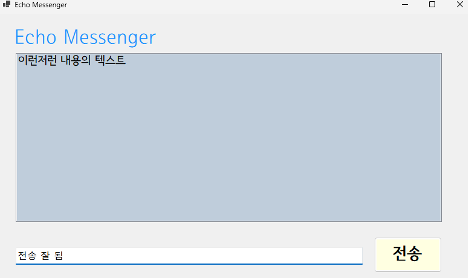
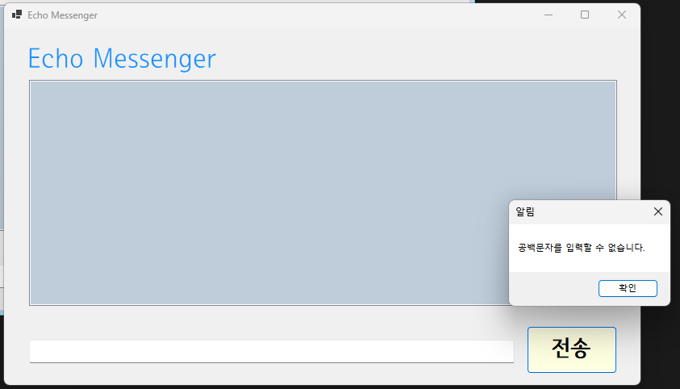
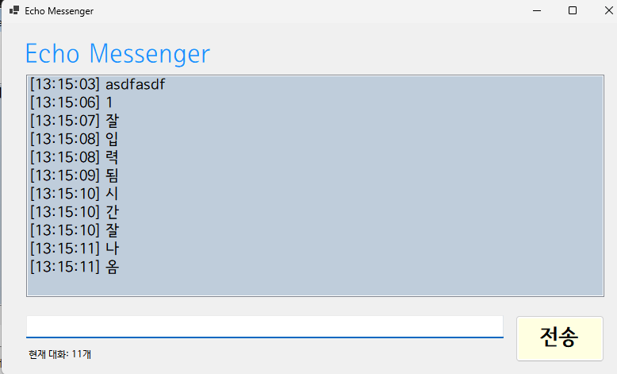
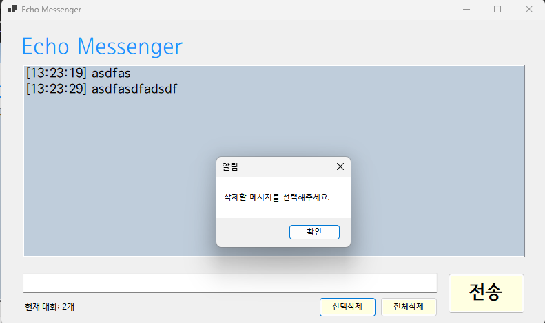

# (C# 코딩) 에코 메신저
## 개요
- C# 프로그래밍 학습
- 1줄 소개: 사용자 키보드 입력을 받아서 처리하는 프로그램
- 사용한 플랫폼:
  - C#, .NET Windows Forms, Visual Studio, GitHub
- 사용한 컨트롤:
  - Label, TextBox, ListBox, Button
- 사용한 기술과 구현한 기능:
  - Visual Studio를 이용하여 UI 디자인
  - string 클래스를 이용한 사용자 입력 데이터 처리
  - DateTime 클래스를 이용한 현재시간 정보 구하기

## 실행 화면 (과제1)
- 과제1 코드의 실행 스크린샷

- 과제 내용
	- Items.Add 및 Clear을 사용하여서 txtbox에 넣은 내용을 리스트박스에 넣고 박스 내용 초기화

- ## 실행 화면 (과제2)
- 과제2 코드의 실행 스크린샷

- 과제 내용
	- txtInput.Focus();로 입력창 자동 포커싱, Enterkey_Input 함수 작성을 하여 keycode 엔터 연결, IsNullOrWhiteSpace로 공백입력방지(저번시간에 배운 알림도 추가)

- ## 실행 화면 (과제3)
- 과제3 코드의 실행 스크린샷

- 과제 내용

- ## 실행 화면 (과제4)
- 과제4 코드의 실행 스크린샷

- 과제 내용
